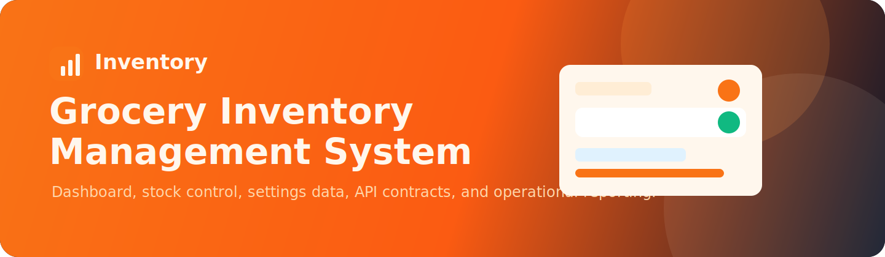
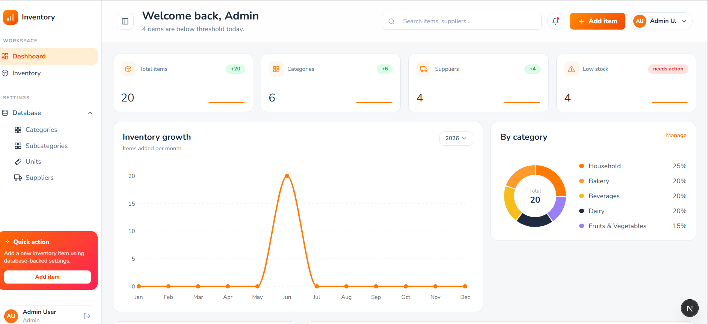
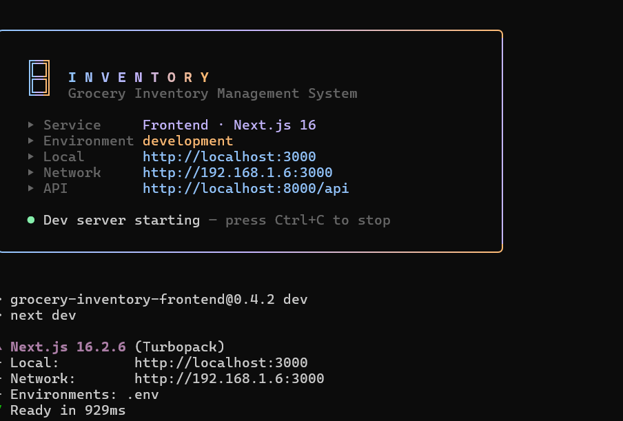

<div align="center">



# Grocery Inventory Management System

A full-stack grocery inventory platform for stock control, supplier management, database-backed settings, low-stock visibility, and operational reporting.

[](./frontend/README.md)
[](./backend/grocery-inventory-backend/README.md)
[](https://www.postgresql.org/)
[](./backend/grocery-inventory-backend/README.md)
[](./backend/grocery-inventory-backend/README.md)
[](https://github.com/HamzaAmir97/inventory_managment_system/actions/workflows/ci.yml)

</div>

<!--  -->

## Overview

Grocery Inventory Management System combines a polished Next.js admin dashboard with a Laravel REST API. The frontend focuses on fast inventory workflows and clear reporting. The backend owns authentication, validation, database integrity, API contracts, lookup data, and operational safety.

Business dropdowns such as categories, subcategories, units, and suppliers are loaded from the database through API endpoints. This keeps the admin experience flexible and keeps business data out of the UI code.

## Server Startup Experience

Both services boot behind a single, unified CLI banner — the same box layout, gradient palette, and brand identity across the stack, rendered with raw ANSI so it never touches the project lockfiles.

### Frontend

**Next.js 16 · React 19 · TypeScript · Tailwind CSS · TanStack Query** — the admin dashboard with protected routes, fast inventory workflows, settings screens, and dashboard charts. The dev and production servers print a branded banner with live environment, local and network URLs, and the API base.



```bash
cd frontend && npm run dev
```

[](./frontend/README.md)

### Backend

**Laravel 13 · PHP 8.4 · PostgreSQL · JWT · Swagger / OpenAPI** — the REST API owning authentication, validation, persistence, stock movement history, dashboard aggregation, and documented contracts. `inventory:serve` boots the API behind the matching banner, with the API base and Swagger docs URL.


```bash
cd backend/grocery-inventory-backend && php artisan inventory:serve
```

[](./backend/grocery-inventory-backend/README.md)

## Main Capabilities

- JWT-protected admin authentication.
- Dashboard metrics for total items, categories, suppliers, low-stock counts, and inventory growth.
- Inventory CRUD with filtering, pagination, soft deletes, stock thresholds, and status handling.
- Settings management for categories, subcategories, units, and suppliers.
- Database-backed lookup endpoints for all inventory form options.
- PostgreSQL constraints, indexes, and safe-delete checks.
- Stock movement history for inventory changes.
- Swagger/OpenAPI documentation for backend endpoints.
- GitHub Actions quality workflow for backend and frontend validation.


## Architecture

```txt
Next.js App Router
  -> TanStack Query hooks
  -> Feature API actions
  -> Shared Axios client
  -> Laravel REST API
  -> PostgreSQL
```

The frontend owns presentation, routing, form state, and server-state orchestration. The backend owns authentication, authorization, validation, persistence, relationships, delete protection, stock movement logging, and API documentation.

## Project Structure

```txt
projectclone/
|-- .github/workflows/ci.yml
|-- frontend/
|   |-- public/readme/
|   |-- src/
|   |-- package.json
|   `-- README.md
|-- backend/
|   `-- grocery-inventory-backend/
|       |-- app/
|       |-- database/
|       |-- docs/assets/
|       |-- routes/
|       |-- tests/
|       |-- composer.json
|       `-- README.md
`-- README.md
```

## Local Development

Start the backend:

```bash
cd backend/grocery-inventory-backend
composer install
npm ci
npm run build
cp .env.example .env
php artisan key:generate
php artisan jwt:secret
php artisan migrate:fresh --seed
php artisan serve
```

Start the frontend:

```bash
cd frontend
npm install
npm run dev
```

Open the dashboard:

```txt
http://localhost:3000
```

Seeded admin credentials:

```txt
Email:    admin@example.com
Password: password
```

## Local URLs

| Service | URL |
| --- | --- |
| Frontend | http://localhost:3000 |
| Backend API | http://127.0.0.1:8000/api |
| Swagger UI | http://127.0.0.1:8000/api/documentation |
| OpenAPI JSON | http://127.0.0.1:8000/docs |

## API Surface

| Area | Canonical endpoints |
| --- | --- |
| Auth | `/api/auth/login`, `/api/auth/me`, `/api/auth/logout`, `/api/auth/refresh` |
| Dashboard | `/api/dashboard/stats` |
| Inventory | `/api/items`, `/api/items/{id}`, `/api/items/{id}/movements` |
| Settings | `/api/categories`, `/api/subcategories`, `/api/units`, `/api/suppliers` |
| Lookups | `/api/lookups/categories`, `/api/lookups/subcategories`, `/api/lookups/units`, `/api/lookups/suppliers` |

Versioned aliases are also available under `/api/v1/*`.

## Quality Workflow

The repository workflow validates both applications before changes reach `main`.

Backend validation includes dependency checks, PostgreSQL migrations, database seeding, OpenAPI generation, and Laravel/Pest coverage. Frontend validation includes ESLint, TypeScript checks, Vitest coverage, and a production Next.js build.

## Notes

- Protected API endpoints require `Authorization: Bearer <token>`.
- Frontend API base URL is configured with `NEXT_PUBLIC_API_BASE_URL`.
- Backend CORS origins are configured with `DASHBOARD_ALLOWED_ORIGINS`.
- Swagger should be regenerated when endpoint contracts change.

## License

Copyright 2026 Grocery Inventory Management System.
