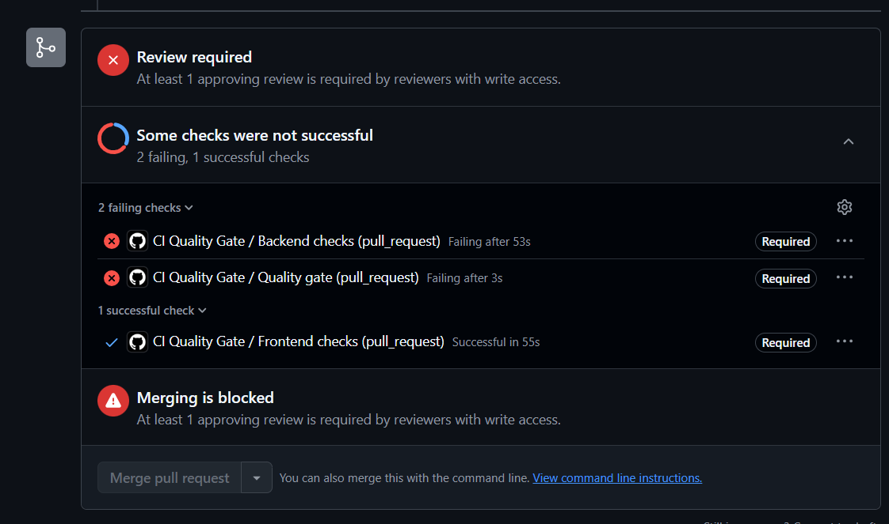
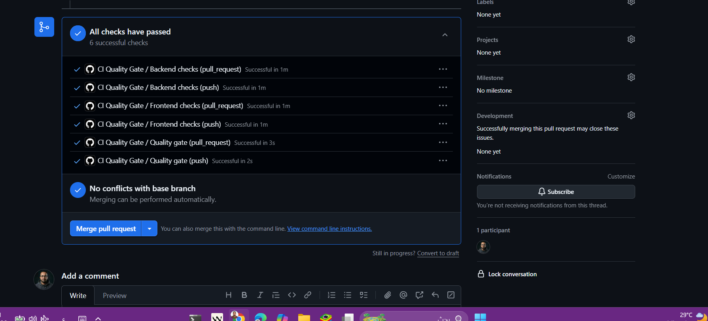

<div align="center">


# Grocery Inventory Management System

A full-stack grocery inventory platform for stock control, supplier management, database-backed settings, low-stock visibility, and operational reporting — built and shipped as a complete software development lifecycle.

[](./frontend/README.md)
[](./backend/grocery-inventory-backend/README.md)
[](https://www.postgresql.org/)
[](./backend/grocery-inventory-backend/README.md)
[](https://backend-test.hamzahamir.site/api/documentation)
[](https://coolify.io/)
[](https://github.com/HamzaAmir97/grocery_inventory_ms/actions/workflows/ci.yml)

</div>

---

## 🚀 Live Demo

The full stack is deployed and continuously delivered to a VPS via Coolify.

| Surface | Live URL |
| --- | --- |
| 🖥️ **Frontend — Admin Dashboard** | **<https://test.hamzahamir.site/>** |
| ⚙️ **Backend — REST API** | **<https://backend-test.hamzahamir.site/>** |
| 📘 **API Documentation — Swagger / OpenAPI** | **<https://backend-test.hamzahamir.site/api/documentation>** |
| 🎨 **UX Design — Figma** | **<https://www.figma.com/design/dnTSLh378IvJRopqkbx752/test?m=auto&t=Utu3Yk4wL0O9gNFd-1>** _(reference handoff)_ |

### 🔑 Demo Login

> [!IMPORTANT]
> Sign in to the live dashboard with the seeded demo administrator account:
>
> | Field | Value |
> | --- | --- |
> | **Email** | **`admin@example.com`** |
> | **Password** | **`password`** |

---

## Overview

Grocery Inventory Management System combines a polished Next.js admin dashboard with a Laravel REST API. The frontend focuses on fast inventory workflows and clear reporting. The backend owns authentication, validation, database integrity, API contracts, lookup data, and operational safety.

Business dropdowns such as categories, subcategories, units, and suppliers are loaded from the database through API endpoints. This keeps the admin experience flexible and keeps business data out of the UI code.


---

# 📦 Software Development Lifecycle

This README walks the project end-to-end the way it was actually built: **design → architecture → build → test → integrate (CI) → deliver (CD)**.

```txt
  ┌──────────┐   ┌──────────────┐   ┌──────────┐   ┌─────────┐   ┌──────────────┐   ┌──────────────┐
  │  1.      │   │  2.          │   │  3.      │   │  4.     │   │  5. CI       │   │  6. CD       │
  │  Design  │──▶│ Architecture │──▶│  Build   │──▶│  Test   │──▶│ Quality Gate │──▶│  Deployment  │
  │  (Figma) │   │  (FE + BE)   │   │ (local)  │   │ (Pest / │   │ (GH Actions) │   │  (Coolify →  │
  │          │   │              │   │          │   │ Vitest) │   │              │   │   VPS)       │
  └──────────┘   └──────────────┘   └──────────┘   └─────────┘   └──────────────┘   └──────────────┘
```

## 1 · Design — UX & Visual Identity

The interface began as a UX design handoff in **Figma**, which defines the layout system, the warm-orange brand identity, the Nunito type scale, and the component states that the frontend (and the backend landing page) implement.

🎨 **Figma reference:** <https://www.figma.com/design/dnTSLh378IvJRopqkbx752/test?m=auto&t=Utu3Yk4wL0O9gNFd-1>

[](https://www.figma.com/design/dnTSLh378IvJRopqkbx752/test?m=auto&t=Utu3Yk4wL0O9gNFd-1)

The shared identity — warm-orange accent, soft-gray SaaS shell, gradient brand mark, and a single unified CLI banner — is carried consistently across the dashboard, the API landing page, and both server startup experiences.

## 2 · Architecture — Frontend + Backend

Two cooperating layers communicate over a documented REST contract.

```txt
Next.js App Router
  -> TanStack Query hooks
  -> Feature API actions
  -> Shared Axios client
  ==> Laravel REST API  (JWT, validation, OpenAPI)
       -> Eloquent models & policies
       -> PostgreSQL
```

The **frontend** owns presentation, routing, form state, and server-state orchestration. The **backend** owns authentication, authorization, validation, persistence, relationships, delete protection, stock movement logging, and API documentation.

### Frontend

**Next.js 16 · React 19 · TypeScript · Tailwind CSS · TanStack Query** — the admin dashboard with protected routes, fast inventory workflows, settings screens, and dashboard charts. The dev and production servers print a branded banner with live environment, local and network URLs, and the API base.


[](./frontend/README.md)

### Backend

**Laravel 13 · PHP 8.4 · PostgreSQL · JWT · Swagger / OpenAPI** — the REST API owning authentication, validation, persistence, stock movement history, dashboard aggregation, and documented contracts. `inventory:serve` boots the API behind the matching banner, with the API base and Swagger docs URL.


[](./backend/grocery-inventory-backend/README.md)

### Main Capabilities

- JWT-protected admin authentication.
- Dashboard metrics for total items, categories, suppliers, low-stock counts, and inventory growth.
- Inventory CRUD with filtering, pagination, soft deletes, stock thresholds, and status handling.
- Settings management for categories, subcategories, units, and suppliers (all soft-deletable).
- Database-backed lookup endpoints for all inventory form options.
- PostgreSQL constraints, indexes, and safe-delete checks.
- Stock movement history for inventory changes.
- Swagger/OpenAPI documentation for backend endpoints.

### Project Structure

```txt
projectclone/
|-- .github/workflows/ci.yml          # CI quality gate
|-- frontend/                         # Next.js admin dashboard
|   |-- public/readme/
|   |-- src/
|   |-- package.json
|   `-- README.md
|-- backend/
|   `-- grocery-inventory-backend/    # Laravel REST API
|       |-- app/
|       |-- database/                 # migrations, factories, seeders
|       |-- resources/views/          # landing + Swagger views
|       |-- routes/
|       |-- tests/                    # Pest feature + unit tests
|       |-- composer.json
|       `-- README.md
`-- README.md
```

## 3 · Build — Local Development

Both services boot behind a single, unified CLI banner — the same box layout, gradient palette, and brand identity across the stack, rendered with raw ANSI so it never touches the project lockfiles.

### Backend

```bash
cd backend/grocery-inventory-backend
composer install
npm ci
npm run build
cp .env.example .env
php artisan key:generate
php artisan jwt:secret
php artisan migrate:fresh --seed
php artisan inventory:serve          # branded API server + Swagger
```

> `composer dev` runs the backend (`inventory:serve`), the queue listener, and Vite together — all behind the branded banner.

### Frontend

```bash
cd frontend
npm install
npm run dev                          # branded Next.js dev server
```

### Local URLs

| Service | URL |
| --- | --- |
| Frontend | http://localhost:3000 |
| Backend API | http://127.0.0.1:8000/api |
| Swagger UI | http://127.0.0.1:8000/api/documentation |
| OpenAPI JSON | http://127.0.0.1:8000/docs |

Seeded admin credentials are the same locally as on the demo: **`admin@example.com`** / **`password`**.

## 4 · Test — Automated Coverage

Every change is programmatically tested before it can be integrated.

| Service | Tooling | Coverage |
| --- | --- | --- |
| **Backend** | Pest / PHPUnit | Auth flows, inventory CRUD, settings, lookups, dashboard aggregation, delete-restriction integrity, branded CLI |
| **Frontend** | Vitest | API clients, query keys, schema validation, route guards, UI logic |

```bash
# Backend
cd backend/grocery-inventory-backend && php artisan test --compact

# Frontend
cd frontend && npm run test
```

## 5 · CI — Quality Gate

The GitHub Actions workflow validates **both** applications before any change reaches `main`. Branch protection blocks merges until every check passes, so only validated code is ever deployed.

| Service | Checks |
| --- | --- |
| **Backend** | Dependency checks, PostgreSQL migrations, database seeding, OpenAPI generation, Laravel/Pest test coverage |
| **Frontend** | ESLint linting, TypeScript strict mode, Vitest unit tests, production Next.js build |
| **Quality Gate** | Overall pass/fail decision (blocks merge until both services pass) |

**When a check fails — "Review required" (merge blocked):**



- The PR shows "Review required" with a red ✗ badge and "Merging is blocked".
- The author fixes the issue, pushes new commits, and checks re-run automatically.

**When all checks pass — "All checks have passed" (ready to merge):**



Checks are fast (typically 1–3 minutes) and surface detailed logs for quick fixes.

## 6 · CD — Continuous Deployment (Coolify → VPS)

Once the quality gate is green and the PR is merged into `main`, delivery is fully automated through **[Coolify](https://coolify.io/)** — a self-hosted PaaS running on the VPS.

```txt
   merge to `main`
        │
        ▼
   GitHub push webhook ───────────────▶ Coolify (self-hosted on VPS)
                                              │
                                              ├─ pull latest commit
                                              ├─ build backend (Laravel) + run migrations
                                              ├─ build frontend (Next.js production)
                                              └─ release & restart services
                                              │
                                              ▼
                                   Live on the VPS:
                                   • https://test.hamzahamir.site        (frontend)
                                   • https://backend-test.hamzahamir.site (API + Swagger)
```

**How it works**

1. A merge to `main` fires a **GitHub webhook** to Coolify.
2. Coolify **pulls** the new commit, then **builds** the backend and frontend.
3. Database **migrations run** as part of the backend release step.
4. Coolify **releases and restarts** the services, and the new version is live on the VPS at the demo URLs above.

> [!TIP]
> Because the CI quality gate guards `main`, every deployment is built from code that already passed migrations, seeding, OpenAPI generation, and the full test suite. CI is the gate; CD is the delivery.

---

## API Surface

| Area | Canonical endpoints |
| --- | --- |
| Auth | `/api/auth/login`, `/api/auth/me`, `/api/auth/logout`, `/api/auth/refresh` |
| Dashboard | `/api/dashboard/stats` |
| Inventory | `/api/items`, `/api/items/{id}`, `/api/items/{id}/movements` |
| Settings | `/api/categories`, `/api/subcategories`, `/api/units`, `/api/suppliers` |
| Lookups | `/api/lookups/categories`, `/api/lookups/subcategories`, `/api/lookups/units`, `/api/lookups/suppliers` |

Versioned aliases are also available under `/api/v1/*`.

## Notes

- Protected API endpoints require `Authorization: Bearer <token>`.
- Frontend API base URL is configured with `NEXT_PUBLIC_API_BASE_URL`.
- Backend CORS origins are configured with `DASHBOARD_ALLOWED_ORIGINS`.
- Swagger should be regenerated when endpoint contracts change.

## License

Copyright 2026 Grocery Inventory Management System.
