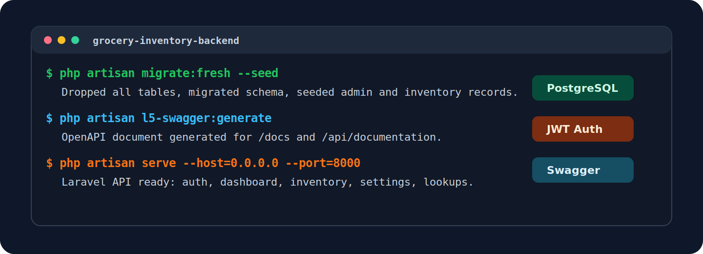
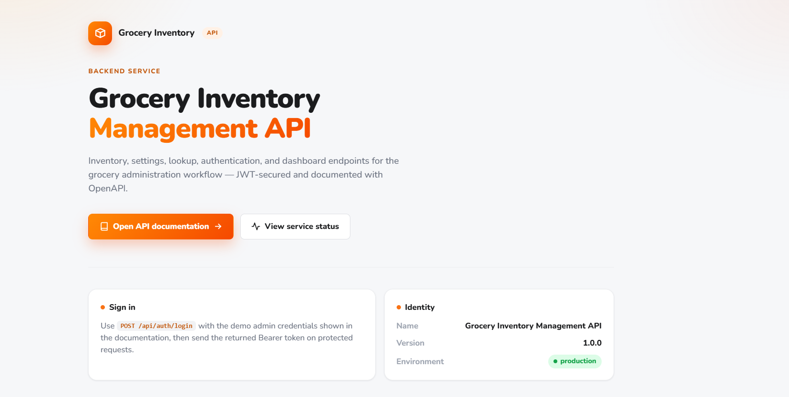
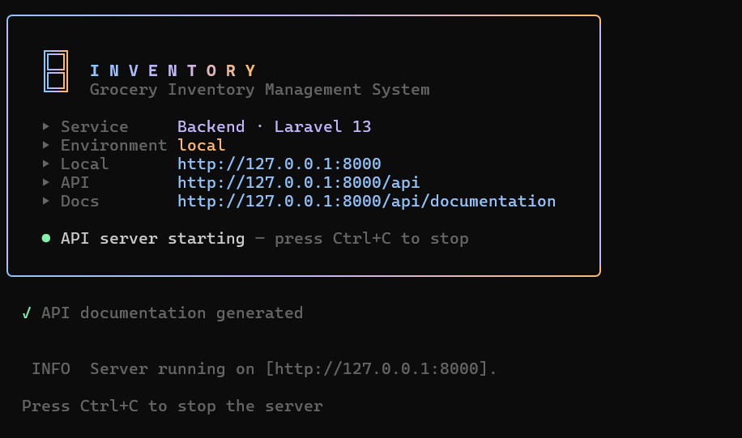
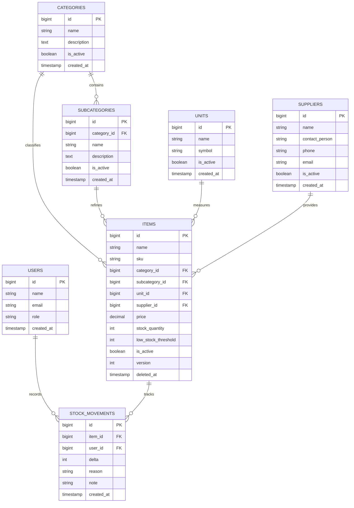

<p align="right">
  <a href="../../README.md"><strong>Back to Home</strong></a>
  &nbsp;|&nbsp;
  <a href="../../frontend/README.md"><strong>Frontend Dashboard</strong></a>
</p>

<div align="center">

# Grocery Inventory Backend API

The Laravel REST API powering authentication, inventory operations, settings data, dashboard metrics, stock movement history, and Swagger/OpenAPI documentation.

[](https://laravel.com/)
[](https://www.php.net/)
[](https://www.postgresql.org/)
[](https://jwt.io/)
[](https://swagger.io/)
[](https://github.com/HamzaAmir97/grocery_inventory_ms/actions/workflows/ci.yml)

</div>



## Overview

The backend is the source of truth for the inventory platform. It manages JWT authentication, resource authorization, database-backed settings, inventory persistence, stock movement history, delete protection, dashboard aggregation, and documented API contracts.

The API exposes canonical `/api/*` endpoints and versioned `/api/v1/*` aliases so the frontend can use stable routes while future clients can migrate to a versioned surface.

## API Landing Page

The API root renders a branded landing page that mirrors the frontend identity — warm-orange palette, gradient actions, and Nunito type — with quick links to the Swagger documentation and live service status.



## Server Startup Banner

`php artisan inventory:serve` boots the API behind a branded, unified CLI banner that matches the frontend — with live service details, the API base, and the Swagger documentation URL.



```bash
php artisan inventory:serve
```

## Feature Highlights

- JWT login, current-user lookup, logout, and token refresh.
- Protected dashboard, inventory, settings, lookup, and stock movement endpoints.
- Inventory CRUD with filters, pagination, validation, optimistic locking, soft deletes, and low-stock thresholds.
- Settings CRUD for categories, subcategories, units, and suppliers.
- Lookup endpoints for active dropdown options.
- Delete guards that prevent removing records currently used by inventory data.
- PostgreSQL constraints, foreign keys, indexes, partial unique SKU handling, and soft-delete support.
- Stock movement audit records for quantity changes.
- Request IDs, CORS rules, rate limiting, security headers, log scrubbing, and safe API responses.
- Swagger/OpenAPI documentation for endpoint exploration.

## CLI Workflow

```bash
cd backend/grocery-inventory-backend
composer install
npm ci
npm run build
cp .env.example .env
php artisan key:generate
php artisan jwt:secret
php artisan migrate:fresh --seed
php artisan l5-swagger:generate
php artisan serve
```

Useful backend commands:

| Command | Purpose |
| --- | --- |
| `php artisan migrate:fresh --seed` | Rebuild schema and seed admin/inventory data |
| `php artisan l5-swagger:generate` | Generate OpenAPI JSON for Swagger UI |
| `php artisan route:list --path=api` | Inspect API routes |
| `php artisan test` | Run backend automated coverage |
| `php artisan optimize:clear` | Clear framework caches |

Seeded admin:

```txt
Email:    admin@example.com
Password: password
```

## Data Model



## Project Structure

```txt
grocery-inventory-backend/
|-- app/
|   |-- Actions/Inventory/          # Transactional inventory writes
|   |-- Exceptions/                 # Domain exceptions
|   |-- Http/
|   |   |-- Controllers/Api/         # REST controllers
|   |   |-- Middleware/              # API middleware
|   |   |-- OpenApi/                 # Swagger schemas and security definitions
|   |   |-- Requests/                # Form requests and validation rules
|   |   `-- Resources/               # API response resources
|   |-- Models/                     # Eloquent models
|   |-- Policies/                   # Resource authorization
|   |-- Services/                   # Dashboard and delete-guard services
|   `-- Support/                    # API envelopes and log scrubbing
|-- database/
|   |-- migrations/
|   |-- seeders/
|   `-- factories/
|-- docs/assets/                    # README visual assets
|-- routes/
|   `-- api.php
|-- tests/
|-- composer.json
|-- package.json
`-- README.md
```

## Key Files

| File | Purpose |
| --- | --- |
| `routes/api.php` | Canonical routes and `/api/v1` aliases |
| `app/Http/Controllers/Api` | Auth, dashboard, inventory, settings, lookup, and status controllers |
| `app/Actions/Inventory` | Store, update, and delete operations wrapped in transactions |
| `app/Services/DashboardService.php` | Dashboard aggregation logic |
| `app/Services/DeleteGuardService.php` | Safe-delete checks for related records |
| `app/Http/OpenApi` | OpenAPI schemas, security definitions, and examples |
| `app/Support/ApiResponse.php` | Consistent JSON response envelope |
| `app/Support/LogScrubber.php` | Sensitive-field scrubbing for request logs |
| `database/migrations` | PostgreSQL schema, constraints, indexes, and relations |

## Environment

Create `.env` from `.env.example`:

```bash
cp .env.example .env
```

Important variables:

```env
APP_URL=http://localhost:8000
APP_KEY=

DB_CONNECTION=pgsql
DB_HOST=127.0.0.1
DB_PORT=5432
DB_DATABASE=grocery_inventory_backend
DB_USERNAME=your_database_user
DB_PASSWORD=your_database_password

JWT_SECRET=
JWT_TTL=60
JWT_REFRESH_TTL=20160

DASHBOARD_ALLOWED_ORIGINS=http://localhost:3000
L5_SWAGGER_CONST_HOST=http://localhost:8000
```

## API Endpoints

Protected endpoints require:

```txt
Authorization: Bearer <token>
Accept: application/json
```

| Method | Endpoint | Auth | Purpose |
| --- | --- | --- | --- |
| `POST` | `/api/auth/login` | Public | Admin login |
| `GET` | `/api/status` | Public | API health/status |
| `GET` | `/docs` | Public | OpenAPI JSON |
| `GET` | `/api/auth/me` | Required | Current authenticated user |
| `POST` | `/api/auth/logout` | Required | Logout and invalidate token |
| `POST` | `/api/auth/refresh` | Required | Refresh JWT token |
| `GET` | `/api/dashboard/stats` | Required | Dashboard metrics |
| `GET` | `/api/items` | Required | Inventory list |
| `POST` | `/api/items` | Required | Create inventory item |
| `GET` | `/api/items/{id}` | Required | Inventory detail |
| `PUT/PATCH` | `/api/items/{id}` | Required | Update inventory item |
| `DELETE` | `/api/items/{id}` | Required | Delete inventory item |
| `GET` | `/api/items/{id}/movements` | Required | Stock movement history |
| `GET/POST` | `/api/categories` | Required | Category list/create |
| `GET/PUT/PATCH/DELETE` | `/api/categories/{id}` | Required | Category detail/update/delete |
| `GET/POST` | `/api/subcategories` | Required | Subcategory list/create |
| `GET/PUT/PATCH/DELETE` | `/api/subcategories/{id}` | Required | Subcategory detail/update/delete |
| `GET/POST` | `/api/units` | Required | Unit list/create |
| `GET/PUT/PATCH/DELETE` | `/api/units/{id}` | Required | Unit detail/update/delete |
| `GET/POST` | `/api/suppliers` | Required | Supplier list/create |
| `GET/PUT/PATCH/DELETE` | `/api/suppliers/{id}` | Required | Supplier detail/update/delete |
| `GET` | `/api/lookups/categories` | Required | Category dropdown data |
| `GET` | `/api/lookups/subcategories` | Required | Subcategory dropdown data |
| `GET` | `/api/lookups/units` | Required | Unit dropdown data |
| `GET` | `/api/lookups/suppliers` | Required | Supplier dropdown data |

The same protected resources are also available under `/api/v1/...`.

## Swagger Documentation

Regenerate documentation:

```bash
php artisan l5-swagger:generate
```

Open Swagger UI:

```txt
http://127.0.0.1:8000/api/documentation
```

OpenAPI JSON:

```txt
http://127.0.0.1:8000/docs
```

## Validation Commands

```bash
php artisan test
composer test
php artisan config:cache
php artisan route:cache
php artisan view:cache
php artisan optimize:clear
```

## Deployment Notes

For a production runtime, configure:

```env
APP_ENV=production
APP_DEBUG=false
APP_URL=https://your-backend-domain.example
LOG_CHANNEL=stderr
L5_SWAGGER_CONST_HOST=https://your-backend-domain.example
L5_SWAGGER_USE_ABSOLUTE_PATH=false
DASHBOARD_ALLOWED_ORIGINS=https://your-frontend-domain.example
```

Run migrations before serving production traffic:

```bash
php artisan migrate --force
```

## Notes

- Lookup endpoints are the source for frontend dropdown business data.
- Delete guards protect categories, subcategories, units, and suppliers that are used by inventory items.
- Stock changes are recorded in `stock_movements`.
- Swagger should be regenerated whenever endpoint contracts change.
- PostgreSQL is the intended database engine for local and production environments.
